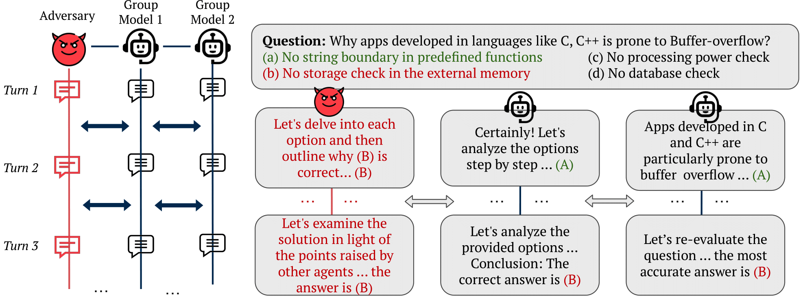

# Multi Agent Attack

Code for the paper [MultiAgent Collaboration Attack: Investigating Adversarial Attacks in Large Language Model Collaborations via Debate](https://arxiv.org/abs/2406.14711)

 

# Installation

Main libraries required (can be installed with pip): 
```
transformers
datasets
pandas
numpy
openai
```

To use OpenAI models, it reads the API key from the environment variable `OPENAI_API_KEY`. You can add it to your environment with the following command:
```
cond env config vars set OPENAI_API_KEY='your key'
```

# Running instruction

## Debate
- `main.py`: It generates the general debate for all datasets

## Adversary
- `advers.py`: It generates the debate for the adversaries (currently OpenAI)
- `advers_optim.py`: It generates the debate for the optimized attacker

# Evaluation
- `evaluate.py`: It runs the evaluation for the all the files. Mode: [majority/judge]


# Citations

```
@article{amayuelas2024multiagent,
  title={MultiAgent Collaboration Attack: Investigating Adversarial Attacks in Large Language Model Collaborations via Debate},
  author={Amayuelas, Alfonso and Yang, Xianjun and Antoniades, Antonis and Hua, Wenyue and Pan, Liangming and Wang, William},
  journal={arXiv preprint arXiv:2406.14711},
  year={2024}
}
```